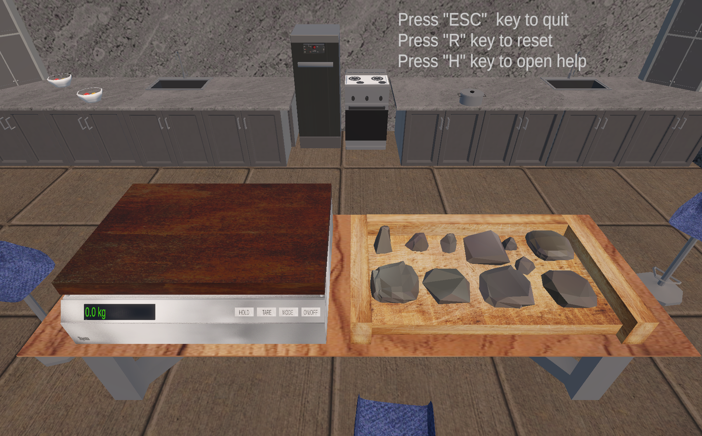
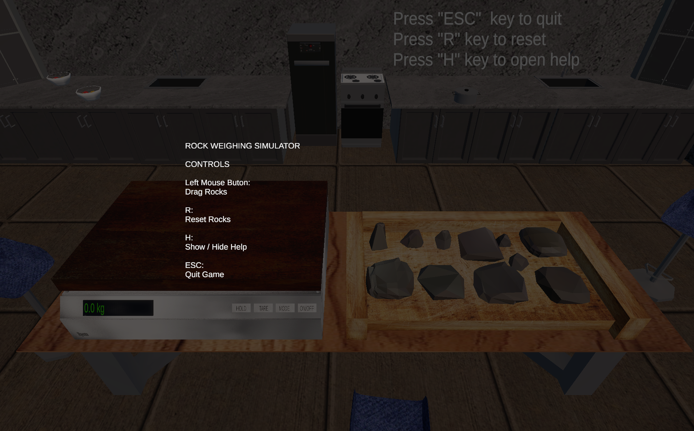

# Rock-Weighing-Simulator
A Unity-based educational physics simulation where players drag and place rocks on a weighing scale to calculate their total weight.

## Features
- Drag and drop physics-based rock objects
- Individual rock weight values
- Automatic weight calculation
- Digital LED weight display
- Stackable rock detection
- Reset system
- Help/control menu
- Custom splash screen

## Controls
| Key | Action |
|-----|--------|
| Left Mouse Button | Drag rocks |
| R | Reset scene |
| H | Show/Hide help |
| ESC | Quit game |

## Screenshots

## Built With
- Unity 6.3
- C#
- TextMeshPro
- Unity Physics System

## Version
Current Version:
v0.1.0 Alpha

## Developer
Prince Jay Dela Luna

## License
MIT License
